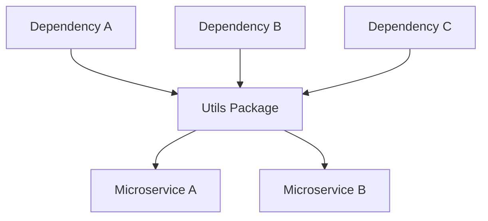
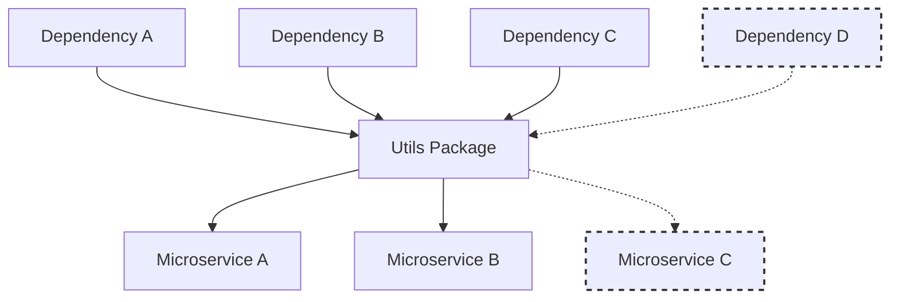
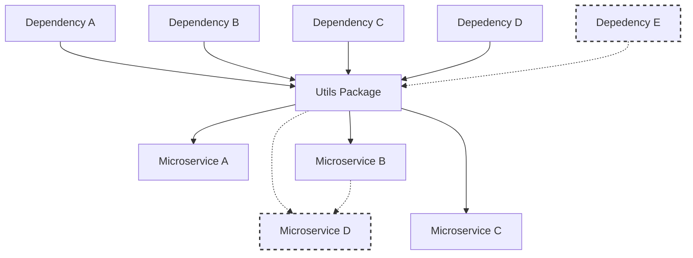
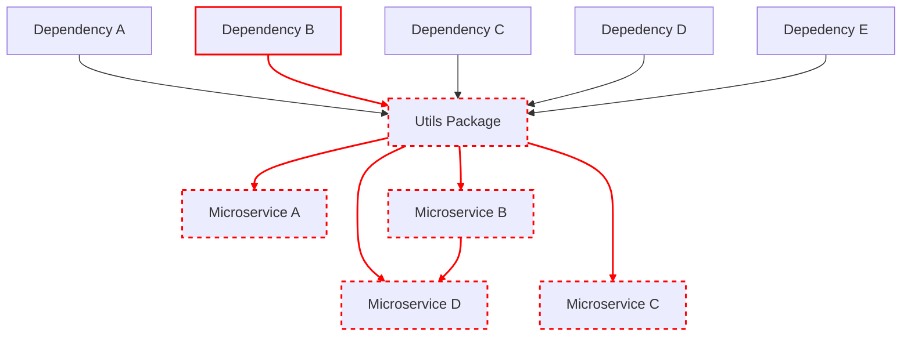

# Utils - Common Pitfalls

Before diving into the pitfalls, it's essential to understand the reasoning behind this article. Throughout my career, I've witnessed a recurring pattern in various teams, often too late to rectify without significant effort. This article aims to share those experiences, not as criticism but as a cautionary tale to foster better practices. The story of building a utils package, while logical at first, can lead to unforeseen complications.

## The Genesis 

Imagine embarking on a new project, where the repetition of tasks across microservices prompts the creation of a utils package to adhere to the DRY (Don't Repeat Yourself) principle. And just like that, a star is born. Your utils package begins its journey as the hero of the story, destined to save you from the perils of repetition.

As the project evolves, this utils package starts to resemble the core of a dependency tree, serving multiple microservices within the architecture. The simplicity of this approach is initially appealing, as it seems to streamline development and maintenance. Oh, the simplicity!

## The Software Expansion

As the project grows, new microservices necessitate the expansion of the utils package, introducing new utilities and dependencies. The complexity increases, yet control seems manageable.

> **Note**: In the diagrams, dashed lines are used to highlight the introduction of new elements—dependencies or microservices—over time. This visual distinction helps trace the evolution of the project's architecture and the expanding role of the utils package.

## The Business Expansion

So far, everything seems great. You're working on improvements, and business is picking up, leading to the development of another microservice. Since you've already established a pattern with two previous microservices, setting up another one follows the same blueprint. Your new microservice requires a few new utility functions. Since they seem potentially useful for future projects, it's clear where they should go. You add them to the utils package. This addition necessitates another dependency. You update the package manager, bump the version, and release it. Life is still manageable, though slightly more complex. You now need to orchestrate deployments carefully and keep track of versions, but it still feels under control.

## The Breakdown
Business has another deadline for you. You and your team imminently started the work. Just when you think you’ve got everything under control, a new challenge arises. A bug is discovered in one of the libraries within your beloved utils package. Worse still, a vulnerability is uncovered, necessitating a hotfix. The centralisation of your utils package now poses a significant risk, complicating the deployment process and revealing the fragility of your system. 

Trust me, this scenario is all too familiar, and it's a stark reminder of the complexities we inadvertently create.

## Breaking the Cycle
I hope by now the conundrum wrapped in a utils package is becoming clearer. While the scenarios we've walked through might still seem on the simpler side (yes, really—they can get much gnarlier), I trust you've gleaned an understanding of where even a well-intentioned adherence to DRY can inadvertently lead us. It turns out, trying to simplify things too early often just relocates the complexity, making it someone else's problem—or worse, your future self's problem.

To effectively tackle these challenges, a more nuanced approach to shared code is essential. Embracing the single responsibility principle for shared libraries can help ensure they remain focused and purposeful, reducing the risk of creating an unwieldy, catch-all utility monster. Sometimes, accepting a bit of repetition in service-specific code is far preferable to weaving a dense web of dependencies that can ensnare your project down the line.

The act of continuous refactoring and ongoing architecture evaluation cannot be overstated. They're not just best practices but survival strategies for maintaining a system that's both sustainable and adaptable. And let's be real—dealing with some duplicated code is often a lesser evil than trying to untangle a mess of poorly orchestrated, tightly coupled utilities.

This tale of evolving from a simple utils package to a complex interdependency network serves as a gentle warning. By recognizing these pitfalls and thoughtfully addressing them, we can forge more resilient, autonomous, and scalable microservices architectures. Hopefully, this discussion sheds light on a path forward, helping both you and me in our future coding adventures.

Happy Codding!
